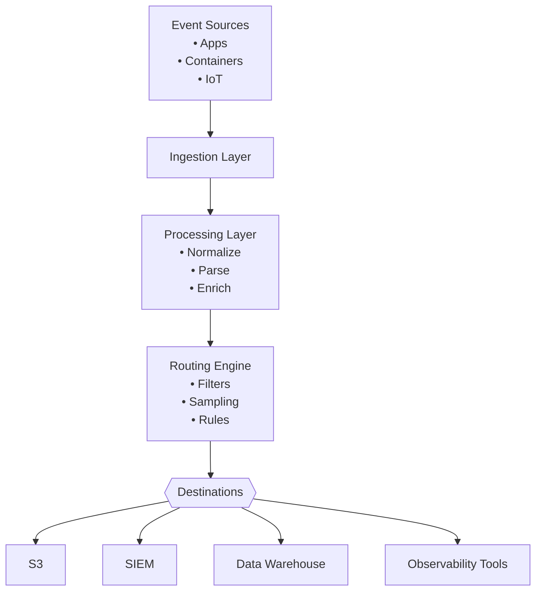

# Event Streams & Observability Pipelines

Modern systems emit massive amounts of telemetry—logs, metrics, traces, security events, and everything between.  
This document explains how **observability pipelines** help teams collect, shape, route, and optimize this data in real time.

Whether you're handling microservices, cloud platforms, containers, or security workloads, understanding these concepts is key to building scalable, cost-effective data flows.

---
## Why Observability Pipelines Matter

Observability pipelines solve real-world challenges:
- **Reduce cost** by filtering or sampling noisy logs before they hit expensive tools  
- **Improve data quality** with parsing, normalization, and metadata enrichment  
- **Protect privacy** by masking or removing PII early  
- **Increase flexibility** with multi-destination routing  
- **Speed up troubleshooting** with real-time processing and transformation  

Every engineering, SRE, and security team benefits from faster, cleaner, and more actionable data.

---
# High-Level Pipeline Architecture (Mermaid Diagram)

---
## ASCII Architecture Overview
```pgsql
   [Event Sources]
     (Apps, Containers, IoT, Security Logs)
                 |
                 v
+-------------------------------+
|        Ingestion Layer        |
| Auth • Validation • Buffering |
+-------------------------------+
                 |
                 v
+-------------------------------+
|       Processing Layer        |
| Parse • Normalize • Enrich    |
| Mask • Transform • Filter     |
+-------------------------------+
                 |
                 v
+-------------------------------+
|         Routing Layer         |
| Rules • Sampling • Fan-out    |
+-------------------------------+
       /          |            \
      v           v             v
   [SIEM]       [S3]       [Elastic]
```

---
## What's an Event Stream?

An **event stream** is a continuous flow of time-ordered telemetry data.  

Common stream types include:
- Application logs
- Metrics
- Distributed tracing spans
- Security audit events
- Authentication logs
- IoT device telemetry
- Cloud platform events

Event streams are high-volume, dynamic, and often unbounded—making real-time processing essential.

---
## Core Components of an Observability Pipeline

### 1. Ingestion Layer

Responsible for:
- Handling input from agents, APIs, syslog, forwarders, cloud providers
- Authenticating and validating data
- Managing backpressure
- Normalizing different event formats

This is where raw data first enters the system.

### 2. Processing Layer

Here’s where the magic happens. Typical operations:
- **Parsing**: JSON, Syslog, CSV, regular expression, custom formats
- **Normalization**: Standardize timestamps, severity levels, field names
- **Enrichment**: Add metadata like host, environment, geo, service name
- **Masking & PII scrubbing**: Protect sensitive fields
- **Transformations**: Reshape or remodel data for downstream tools
- **Filtering**: Remove low-value or noisy events

The processing layer shapes your data into something clean, usable, and consistent.

### 3. Routing Layer
Determines **where events should go** based on business, compliance, or engineering needs.

Routing strategies include:
- Forwarding security logs to a **SIEM**
- Sending long-term storage data to **S3/GCS**
- Shipping app logs to **Elastic**
- Sending metrics to **Datadog**
- Fanning out data to various tools at once
- Routing noisy logs through sampling rules to cut costs

Routing transforms a monolithic “send everything everywhere” pipeline into a targeted, efficient ecosystem.

### 4. Destination Layer

Where your processed events land:
- **Object storage** (S3, GCS, Azure Blob)
- **SIEM** (Splunk, QRadar, Chronicle)
- **Search platforms** (Elastic, OpenSearch)
- **Analytics systems** (Snowflake, BigQuery)
- **Monitoring tools** (Datadog, New Relic, Grafana)
- **Custom APIs or internal systems**

By cleaning and shaping data beforehand, downstream tools run faster and cheaper.
 
---
## Common Use Cases

- **Security analytics**: Route auth failures, firewall events, and audit logs
- **Cost reduction**: Filter verbose logs or sample high-volume streams
- **Data normalization**: Standardize across services and environments
- **Multi-destination routing**: Send different subsets of data to different teams
- **Real-time enrichment**: Add metadata for simplified filtering, dashboards, and alerting
- **Data quality enforcement**: Ensure compliance and schema consistency
---
## Key Takeaways

- Event streams are noisy, varied, and continuous
- Processing cleans and enriches data for better insights
- Routing allows precise control over where data flows
- Observability pipelines reduce cost, improve reliability, and empower teams
- A well-designed pipeline turns raw telemetry into actionable intelligence
---
## Next Steps

- Explore multi-destination routing rules
- Add parsing or enrichment to your existing streams
- Try building a cost-saving sampling policy
- Add security use cases with filtering and PII scrubbing