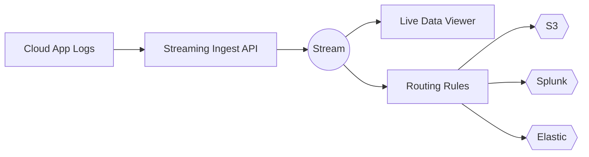

# Route Cloud Application Logs Into a Pipeline

Cloud applications generate a continuous stream of operational data—logs, metrics, audit trails, security events, and more.  
This guide walks you through **sending cloud logs into a streaming pipeline**, verifying they arrived, and **routing them to destinations** like S3, Splunk, Elastic, or Snowflake.

You’ll go from **raw cloud logs → ingestion API → processing → routing → destination**, all in a few steps.  


---

## Why This Matters

Routing logs into a pipeline lets you:

- Filter noisy data before it hits expensive analytics tools  
- Normalize and enrich logs for better search & insights  
- Route different slices of data to different teams  
- Build scalable, vendor-agnostic observability workflows  

---

## Before You Start

Make sure you have:

- An **ingestion-enabled API token**
- A valid **Stream ID**
- A JSON log sample from your cloud app
- `curl` or Postman installed
- Access to configure your pipeline destinations

---

## Pipeline Overview (Mermaid Diagram)


## Architecture Overview
```lua
Cloud App Logs
      |
      v
+-----------------+       +------------------+
|  Ingest API     | --->  |  Stream Pipeline |
| (POST /ingest)  |       | (Parse/Enrich)   |
+-----------------+       +------------------+
                                 |
                                 v
                        +------------------+
                        |  Routing Engine  |
                        +------------------+
                     /        |         \
                    v         v          v
                 [S3]      [Splunk]    [Elastic]
```


## 1. Create or Select a Stream

1. Go to **Pipelines** → **Streams**
2. Create a new Stream or use an existing one
3. Copy the **Stream ID**
4. (Optional) Add:
    - Parsing rules
    - Metadata enrichment
    - PII scrubbing
    - Sampling or filtering

**Tip**: Keep your stream basic at first—add parsing and enrichment after verifying ingestion.

## 2. Create a Sample Log Event
Create a file, name it `event.json`.
```json
{
  "timestamp": "2025-02-12T18:20:03Z",
  "source": "orders-service",
  "level": "info",
  "message": "Order processed",
  "orderId": "ORD-91122",
  "latency_ms": 134
}
```

### Notes
- Timestamp must be **ISO 8601**
- Include a clear `source` field for parsing & routing
- Add any custom metadata your team needs

## 3. Send the Log Event
Run this `curl` command, replacing placeholders:
```bash
curl -X POST "https://api.example.com/v1/streams/ingest" \
  -H "Authorization: Bearer $TOKEN" \
  -H "Content-Type: application/json" \
  -H "X-Stream-Id: $STREAM_ID" \
  -d @event.json
```
### Expected Response
```json
{
  "status": "accepted",
  "ingested_bytes": 204
}
```
`accepted` means the pipeline accepted your event and is processing it.

## 4. Verify Your Log in the Live Data Viewer

Open:

**Pipelines → Live Data Viewer**

You should see:

    - Parsed fields
    - Metadata from your payload
    - Timestamp normalized
    - Source name

If nothing appears:

    - Double-check `X-Stream-Id`
    - Validate timestamp format
    - Confirm token permissions

## 5. Route Logs to a Destination

You can route logs to:

    - **S3 / GCS**
    - **Elastic**
    - **Splunk**
    - **Datadog**
    - **Snowflake**
    - **Security analytics tools**

To configure routing:

1. Open **Destinations**
2. Choose a destination type
3. Paste in credentials
4. Test and save
5. Add routing rules inside your Stream

Your flow now looks like:
```arduino
Cloud App → Ingest API → Stream → Routing Rules → Destination
```
## 6. Optimize the Pipeline

Recommended adjustments:

- **Sampling**: Reduce log volume
- **Filtering**: Remove noisy or useless events
- **Enrichment**: Add metadata (service, region, team)
- **Normalization**: Standardize fields for downstream tools
- **Masking**: Remove PII

## Troubleshooting

| Problem                      | Likely Cause            | Fix                                 |
| ---------------------------- | ----------------------- | ----------------------------------- |
| Logs not appearing in viewer | Wrong Stream ID         | Recopy the Stream ID                |
| “invalid_format” error       | JSON or timestamp issue | Check JSON, ensure ISO timestamp |
| Missing fields               | Parser mismatch         | Adjust parsing rules                |
| High ingestion cost             | Too much data           | Add sampling or filters             |

## Next Steps

- Add multi-destination routing
- Add field extraction and normalization
- Create dashboards using routed data
- Add more sources (VM logs, container logs, API events)